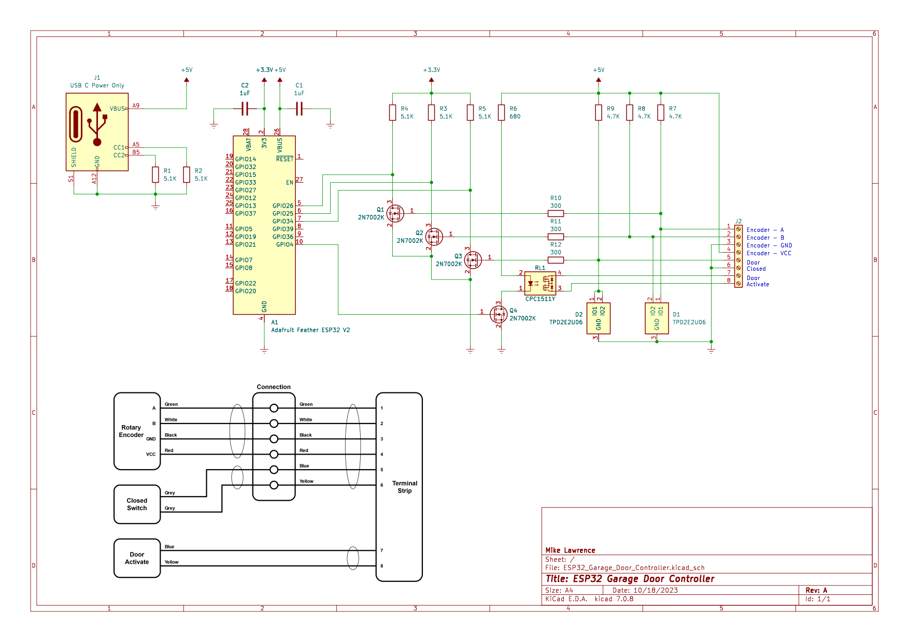

# ESP32 Garage Door Controller
ESPHome based garage door controller. There are a lot of garage door controller projects on the web, what makes this one unique is the use of a rotary encoder to determine garage door position. You need a garage door opener that supports a SPST switch to operate. Some openers (I'm talking about Chamberlain models) don't have this option on the unit. 

On a side note: Chamberlain recently stopped third party API access to MyQ which killed control for all sorts of home automation including Home Assistant. I realize that company's have the right to limit access and to control their ecosystem. But what Chamberlain did was close access to their API after many people bought their opener with third party access available. They also did this so that you will be forced to pay for access your garage door opener from your phone. There is no reason to buy a Chamberlain system when there are other systems that don't charge for access and have open APIs. Vote with your pocketbook and just say NO to Chamberlain Garage Door Openers! 

## Status
* The Entire assembly has been attached to my Genie garage door opener for the last year and has been operating like a champ!

## PCB
PCB is designed in [KiCad](http://kicad.org) which is a great free EDA toolset

## PCB Preview



## PCB Parts List
| Qty   | Reference | Value           | Description                                   | Manufacturer                | Part Number        |
| :---  | :---      | :---            | :---                                          | :---                        | :---               |
| 1     | A1        |                 | Mod, Adafruit Feather ESP32 V2                | Adafruit                    | 5400               |
| 2     | C1, C2    | 1uF             | Cap, Ceramic, 1uF, 10V, 10%, 0805             | Kemet                       | C0805C105K8RACTU   |
| 1     | D1, D2    |                 | IC, High-Speed ESD Protection Device, SOT-553 | TI                          | TPD2E2U06DRLR      |
| 1     | J1        |                 | Conn, USB-C Power Only, SMT                   | GCT                         | USB4135-GF-A       |
| 1     | J2        |                 | Conn, Terminal Strip, 8-Pos, 3.5 mm           | Phoenix Contact             | 1843664            |
| 1     |           |                 | Conn, Terminal Strip, 8-Pos, 3.5 mm (mate)    | Phoenix Contact             | 1863217            |
| 1     | Q1-Q4     |                 | Trans, N-Ch MOSFET, 60V, 300mA, SOT-23        | OnSemi                      | 2N7002K            |
| 1     | R1-R5     | 5.1k            | Res, 5.1k, 100mW, 5%, 0603                    | YAGEO                       | RC0603JR-075K1L    |
| 1     | R6        | 680             | Res, 680, 100mW, 5%, 0603                     | YAGEO                       | RC0603JR-07680RL   |
| 1     | R7-R9     | 4.7k            | Res, 4.7k, 100mW, 5%, 0603                    | YAGEO                       | RC0603JR-074K7L    |
| 1     | R10-R12   | 300             | Res, 300, 100mW, 5%, 0603                     | YAGEO                       | RC0603JR-07300RL   |
| 1     | RL1       |                 | IC, Solid State Relay, 230V, 450mA, SIP       | IXYS                        | CPC1511Y           |

## 3D Box
I used Autodesk Fusion 360 to design a small clamshell box. This box has holes for 10mm X 3mm round magnets which hold the box pretty securely on a metal opener. There are two version of the box. One has two holes in the lid for standard PG0 gland nuts. The other has three holes for gland nuts.

Use M2.5 brass inserts and M2.5X8mm screws to hold the PCB. Use M3 brass inserts and M3x25mm screws to screw the box halves together. I've included STEP files so that you can 3D Print your own. I've also included the Autodesk Fusion 360 file so you can modify to your heart's content.


## Code

```yaml
substitutions:
  name: "car-garage-door"
  friendly_name: "Car Garage Door"
  max_count: "7000"
  invert_encoder: "true"

esphome:
  name: ${name}
  friendly_name: ${friendly_name} 
  name_add_mac_suffix: false

esp32:
  board: adafruit_feather_esp32_v2
  framework:
    type: arduino

# Enable logging
logger:

# Enable Home Assistant API
api:
  encryption:
    key: !secret api_key

# Enable Over-the-Air updates
ota:
  platform: esphome
  password: !secret ota_password

wifi:
  ssid: !secret wifi_ssid
  password: !secret wifi_password
  # using fast_connect since it is required for hidden networks.
  fast_connect: true

  # Captive portal credentials
  ap:
    ssid: "${friendly_name} Hotspot"
    password: !secret hotspot_password

# Enable Fallback WiFi hotspot
captive_portal:

# Enable easy WiFi config via serial port
improv_serial:

globals:
  - id: door_state
    type: int
    restore_value: no
    # CLOSED = 0, OPENING = 1, STOPPED OPENING = 2, CLOSING = 3, STOPPED CLOSING = 4,  OPEN = 5

  - id: max_count
    type: int
    restore_value: no
    initial_value: "${max_count}"

light:
  - platform: neopixelbus
    id: led
    name: "${friendly_name} LED"
    internal: true
    type: GRB
    variant: WS2812
    pin: GPIO0
    num_leds: 1

switch:
  - platform: gpio
    id: button_press
    name: "${friendly_name} Button"
    internal: true
    pin: GPIO4

binary_sensor:
  - platform: gpio
    id: garage_open
    name: "${friendly_name} Sensor"
    pin:
      number: GPIO34
      mode: INPUT
      inverted: true
    device_class: garage_door
    publish_initial_state: true
    filters:
      - delayed_on_off: 50ms
    on_press:
      then:
        - sensor.rotary_encoder.set_value:
            id: position_encoder
            value: 0
        - logger.log: "Closed Switch: Reset Encoder Value"

sensor:
  - platform: rotary_encoder
    id: position_encoder
    name: "${friendly_name} Position"
    internal: true
    pin_a:
      number: GPIO26
      # inverted: true
      mode: INPUT_PULLUP
    pin_b:
      number: GPIO25
      mode: INPUT_PULLUP
    resolution: 1
    min_value: 0
    max_value: 10000
    restore_mode: ALWAYS_ZERO
    publish_initial_value: true
    filters:
    - lambda: !lambda |-
        int min = round(id(max_count) / 50.0);
        int max = id(max_count) - min;
        if (x > max) {
          return 100.0;
        } else if (x < min) {
          return 0.0;
        } else {
          // round to nearest 5 %
          return round(round(x * 100 / id(max_count)) / 5) / 20.0;
        }
    - delta: 0.005

  - platform: wifi_signal
    name: "${friendly_name} WiFi RSSI"
    disabled_by_default: true
    update_interval: 60s
    
  - platform: uptime
    name: "${friendly_name} Uptime"
    disabled_by_default: true
    update_interval: 60s

text_sensor:
  - platform: wifi_info
    ip_address:
      name: "${friendly_name} IP Address"
      disabled_by_default: true

cover:
  - platform: template
    id: template_cover
    name: "${friendly_name}"
    device_class: garage
    optimistic: false
    assumed_state: false
    has_position: true
    lambda: |-
      static double last_position = 0.0;
      static uint32_t last_change = 0;
      double position = id(position_encoder).state;
      auto call = id(led).turn_on();
      call.set_brightness(0.5);
      call.set_transition_length(0);
      if (position == 0.0) {
        id(template_cover).current_operation = CoverOperation::COVER_OPERATION_IDLE;
        id(door_state) = 0;         // CLOSED
        call.set_rgb(0.0,1.0,0.0);  // LED is green
      } else if (position == 1.0) {
        id(template_cover).current_operation = CoverOperation::COVER_OPERATION_IDLE;
        id(door_state) = 5;         // OPEN
        call.set_rgb(1.0,0.0,0.0);  // LED is red
      } else if (last_position < position) {
        id(template_cover).current_operation = CoverOperation::COVER_OPERATION_OPENING;
        id(door_state) = 1;         // OPENING
        call.set_rgb(1.0,0.5,0.0);  // LED is orange
      } else if (last_position > position) {
        id(template_cover).current_operation = CoverOperation::COVER_OPERATION_CLOSING;
        id(door_state) = 3;       // CLOSING
        call.set_rgb(1.0,0.5,0.0);  // LED is orange
      } else if (millis() - last_change > 1000) {
        // the one second wait before recognizing a stopped state allows for bounce when stopped
        id(template_cover).current_operation = CoverOperation::COVER_OPERATION_IDLE;
        if (id(door_state) == 1) {
          id(door_state) = 2;     // STOPPED OPENING
          // if position hasn't changed the cover doesn't publish a current_operation change
          id(template_cover).publish_state();
        } else if (id(door_state) == 3) {
          id(door_state) = 4;     // STOPPED CLOSING
          // if position hasn't changed the cover doesn't publish a current_operation change
          id(template_cover).publish_state();
        }
      }
      if (position != last_position) {
        last_change = millis();
      }
      last_position = position;
      return position;
    open_action:
      - lambda: !lambda |-
          if (id(door_state) == 0) {          // CLOSED
            // CLOSED -> OPENING
            ESP_LOGD("main", "Open action when door is CLOSED, single tap");
            id(single_press).execute();
          } else if (id(door_state) == 1) {  // OPENING
            // already OPENING
            ESP_LOGD("main", "Open action when door is OPENING, do nothing");
          } else if (id(door_state) == 2) {   // STOPPED OPENING
            // STOPPED OPENING(2) -> CLOSING -> STOPPED CLOSING -> OPENING
            ESP_LOGD("main", "Open action when door is STOPPED OPENING, triple tap");
            id(triple_press).execute();
          } else if (id(door_state) == 3) {   // CLOSING
            // CLOSING -> STOPPED CLOSING -> OPENING
            ESP_LOGD("main", "Open action when door is CLOSING, double tap");
            id(double_press).execute();
          } else if (id(door_state) == 4) {  // STOP CLOSING
            // STOPPED CLOSING -> OPENING
            ESP_LOGD("main", "Open action when door is STOPPED CLOSING, single tap");
            id(single_press).execute();
          } else if (id(door_state) == 5) {  // OPEN
            // already OPEN
            ESP_LOGD("main", "Open action when door is OPEN, do nothing");
          }
    close_action:
      - lambda: !lambda |-
          if (id(door_state) == 0) {          // CLOSED
            // already CLOSED
            ESP_LOGD("main", "Close action when door is CLOSED, do nothing");
          } else if (id(door_state) == 1) {   // OPENING
            // OPENING -> STOPPED OPENING -> CLOSING
            ESP_LOGD("main", "Close action when door is OPENING, double tap");
            id(double_press).execute();
          } else if (id(door_state) == 2) {   // STOPPED OPENING
            // STOPPED OPENING -> CLOSING
            ESP_LOGD("main", "Close action when door is STOPPED OPENING, single tap");
            id(single_press).execute();
          } else if (id(door_state) == 3) {   // CLOSING
            // already CLOSING
            ESP_LOGD("main", "Close action when door is CLOSING, do nothing");
          } else if (id(door_state) == 4) {   // STOPPED CLOSING
            // STOPPED CLOSING -> OPENING -> STOPPED OPENING -> CLOSING
            ESP_LOGD("main", "Close action when door is STOPPED CLOSING, triple tap");
            id(triple_press).execute();
          } else if (id(door_state) == 5) {   // OPEN
            // OPEN -> CLOSING
            ESP_LOGD("main", "Close action when door is OPEN, single tap");
            id(single_press).execute();
          }
    stop_action:
      - lambda: !lambda |-
          if (id(door_state) == 0) {          // CLOSED
            // already stopped
            ESP_LOGD("main", "Stop action when door is CLOSED, do nothing");
          } else if (id(door_state) == 1) {   // OPENING
            // OPENING -> STOPPED OPENING
            ESP_LOGD("main", "Stop action when door is OPENING, single tap");
            id(single_press).execute();
          } else if (id(door_state) == 2) {   // STOPPED OPENING
            // already stopped
            ESP_LOGD("main", "Stop action when door is STOPPED OPENING, do nothing");
          } else if (id(door_state) == 3) {   // CLOSING
            // CLOSING -> STOPPED CLOSING
            ESP_LOGD("main", "Stop action when door is CLOSING, single tap");
            id(single_press).execute();
          } else if (id(door_state) == 4) {   // STOPPED CLOSING
            // already stopped
            ESP_LOGD("main", "Stop action when door is STOPPED CLOSING, do nothing");
          } else if (id(door_state) == 5) {   // OPEN
            // already stopped
            ESP_LOGD("main", "Stop action when door is OPEN, do nothing");
          }

script:
  - id: single_press
    then:
    - if:
        # do nothing if another press script is running
        condition:
          and:
            - not:
                script.is_running: double_press
            - not:
                script.is_running: triple_press
        then:
          - switch.turn_on: button_press
          - delay: 0.2s
          - switch.turn_off: button_press
          - delay: 2s

  - id: double_press
    then:
    - if:
        # do nothing if another press script is running
        condition:
          and:
            - not:
                script.is_running: single_press
            - not:
                script.is_running: triple_press
        then:
          - switch.turn_on: button_press
          - delay: 0.2s
          - switch.turn_off: button_press
          - delay: 1s
          - switch.turn_on: button_press
          - delay: 0.2s
          - switch.turn_off: button_press
          - delay: 2s

  - id: triple_press
    then:
    - if:
        # do nothing if another press script is running
        condition:
          and:
            - not:
                script.is_running: single_press
            - not:
                script.is_running: double_press
        then:
          - switch.turn_on: button_press
          - delay: 0.2s
          - switch.turn_off: button_press
          - delay: 1s
          - switch.turn_on: button_press
          - delay: 0.2s
          - switch.turn_off: button_press
          - delay: 1s
          - switch.turn_on: button_press
          - delay: 0.2s
          - switch.turn_off: button_press
          - delay: 2s
```
